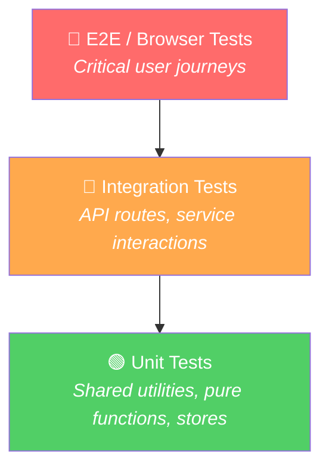

# NextDestination.ai — Automation Test Plan (Broad Overview)

> [!NOTE]
> This is a **high-level, big-picture** test plan to map out all the testable areas of the application. We will refine each section further in subsequent iterations — choosing tools, writing actual test cases, and prioritising coverage.

---

## 1. Application Overview

**NextDestination.ai** is an AI-powered travel itinerary builder built as a **monorepo** with:

| Layer | Technology | Key Details |
|---|---|---|
| **Frontend** | Next.js 16 + React 19 + Tailwind CSS | 17 app routes, Zustand store, DnD-kit, Google Maps |
| **Backend API** | Express.js (Node) | 10 route modules, rate limiting, Helmet, CORS |
| **Databases** | Supabase (PostgreSQL) + Neo4j | Auth, profiles, itineraries, graph relationships |
| **AI Services** | Google Gemini, ElevenLabs | Itinerary generation, voice agent |
| **Payments** | Stripe Checkout | Plan upgrades, webhooks |
| **Shared Package** | TypeScript | Services, stores, types shared across web & mobile |

**Current test state:** No unit/integration/E2E tests exist. Only k6 load/smoke tests in `load-tests/`.

---

## 2. Test Pyramid & Strategy

| Level | Scope | Volume | Speed |
|---|---|---|---|
| **Unit** | Pure functions, utilities, Zustand stores, data transformers | High (~60%) | Fast |
| **Integration** | API route handlers, middleware, service-to-DB interactions | Medium (~25%) | Moderate |
| **E2E / Browser** | Full user journeys across frontend + backend | Low (~15%) | Slow |

---

## 3. Test Areas — Feature Map

### 3.1 🔐 Authentication & Authorization

| Area | What to Test | Level |
|---|---|---|
| **Signup flow** | Email/password registration, validation, redirect | E2E |
| **Login flow** | Successful login, invalid credentials, token storage | E2E |
| **Session management** | Token refresh, session expiry, logout | Integration |
| **Auth middleware** (`verifyAuth`, `optionalAuth`) | Valid/invalid/missing tokens, cache behaviour, FIFO eviction | Unit + Integration |
| **Role-based access** (`roleAuth.js`) | Role checks, plan-gated features, admin access | Unit + Integration |
| **Protected routes** | Redirect to login for unauthenticated users | E2E |

---

### 3.2 🏠 Homepage & Navigation

| Area | What to Test | Level |
|---|---|---|
| **Landing page** | Hero rendering, search header, category bar, itinerary grid | E2E |
| **Chat widget** (`HomeChatWidget`) | AI chat interaction, message flow | E2E |
| **Navbar** | Links, auth state display, mobile hamburger | E2E |
| **Footer pages** | Terms, privacy, accessibility, contact rendering | E2E (smoke) |
| **SEO elements** | Meta tags, robots.txt, sitemap generation | Integration |

---

### 3.3 🗺️ Planning & Suggestions

| Area | What to Test | Level |
|---|---|---|
| **Destination search** | Search input, autocomplete, destination selection | E2E |
| **Duration chips** | Preset selections (Tight/Balanced/Relaxed), custom dates | E2E |
| **Community trip filters** | Solo, couple, family filtering | E2E |
| **AI itinerary generation** | API call, loading states, error handling, timeout behaviour | Integration + E2E |
| **Suggestions API** (`/api/suggestions`) | Request validation, Gemini integration, response format | Integration |
| **Attraction caching** | DB lookup → AI fallback → cache write | Integration |

---

### 3.4 📋 Itinerary Builder (Core Feature)

| Area | What to Test | Level |
|---|---|---|
| **Itinerary display** (`ItineraryDisplay.tsx` — 58KB) | Day rendering, activity cards, timeline view | E2E |
| **Drag & drop** (DnD-kit) | Reorder activities, move between days, edge cases | E2E |
| **Activity management** | Add, remove, edit activities | E2E |
| **Activity search** (`ActivitySearchPanel`) | Search, filters, add to itinerary | E2E |
| **Hotel search** (`HotelDetailsPanel`) | Search, debounce, display results | E2E |
| **Map integration** (`MapComponent`) | Markers, zoom, place preview | E2E |
| **Transport info** (`TransportInfoPanel`) | Transport options, duration estimates | E2E + Integration |
| **Voice agent** (`VoiceAgent` + ElevenLabs) | Activation, voice commands, tool invocations | E2E (manual + limited auto) |
| **Save itinerary** | Save new, update existing, remix community trip | Integration + E2E |
| **Privacy toggle** | Public/private visibility | E2E |
| **Share itinerary** | Share link generation, shared view rendering | E2E |

---

### 3.5 👤 User Profile

| Area | What to Test | Level |
|---|---|---|
| **Profile page** | Display user data, itineraries list, wishlist | E2E |
| **Profile API** (`/api/profile`) | CRUD operations, avatar upload | Integration |
| **My itineraries** | List, filter, delete itineraries | E2E |
| **Wishlist** (`/api/wishlist`) | Add, remove, list wishlist items | Integration + E2E |
| **Settings modal** | Preference updates | E2E |

---

### 3.6 🌍 Community

| Area | What to Test | Level |
|---|---|---|
| **Community page** (`CommunityPage`) | Browse public itineraries, card rendering | E2E |
| **Community card** (`CommunityItineraryCard`) | Image, title, description, action buttons | Unit + E2E |
| **Itinerary detail modal** | Full detail view, remix button | E2E |
| **Remix flow** | Clone community itinerary into personal builder | E2E |

---

### 3.7 💳 Payments (Stripe)

| Area | What to Test | Level |
|---|---|---|
| **Upgrade page** | Plan display, CTA buttons | E2E |
| **Checkout session** (`/api/stripe`) | Session creation, redirect to Stripe | Integration |
| **Webhook handling** | Payment success, subscription updates | Integration |
| **Plan-gated features** | Free vs premium feature access | Integration + E2E |

---

### 3.8 🔌 Backend API Routes

| Route Module | Endpoints to Test | Level |
|---|---|---|
| `itineraries.js` (17KB — largest) | CRUD, search, public listing, save/remix, image association | Integration |
| `suggestions.js` | AI generation, caching, error handling | Integration |
| `transport.js` | Flights, transport options, general info, attractions | Integration |
| `activities.js` | Activity search, CRUD | Integration |
| `destinations.js` | Destination lookup, caching | Integration |
| `recommendations.js` | Recommendation engine | Integration |
| `userProfile.js` | Profile CRUD, avatar | Integration |
| `wishlist.js` | Wishlist CRUD | Integration |
| `stripe.js` | Checkout, webhooks | Integration |
| `sitemap.js` | Dynamic sitemap generation | Integration |

---

### 3.9 🧩 Backend Services

| Service | What to Test | Level |
|---|---|---|
| `gemini.js` (25KB — largest) | Prompt construction, response parsing, error handling, retries | Unit + Integration |
| `googleMaps.js` | API calls, geocoding, place details | Unit (mocked) |
| `imageGenerationService.js` | Image generation prompts, duplicate prevention, storage | Unit + Integration |
| `templateService.js` | Template rendering, data transformation | Unit |
| `vectorService.js` | Vector search queries | Unit |

---

### 3.10 📦 Shared Package

| Area | What to Test | Level |
|---|---|---|
| **Services** (12 files) | API config, supabase client, storage adapter, hydration, itinerary/community/transport/weather services | Unit |
| **Zustand stores** | State management logic, actions, selectors | Unit |
| **Type definitions** | TypeScript compile checks (typecheck script already exists) | Build verification |
| **Utilities** | Data transformation helpers | Unit |

---

### 3.11 ⚙️ Non-Functional / Cross-Cutting

| Area | What to Test | Level |
|---|---|---|
| **Rate limiting** | General (100/15min) and AI (15/15min) limits | Integration |
| **CORS** | Allowed/blocked origins, Vercel previews | Integration |
| **Request timeouts** | 30s default, 90s for AI routes | Integration |
| **Security headers** (Helmet) | HSTS, X-Frame-Options, etc. | Integration |
| **Error handling** | Sentry integration, graceful error responses | Integration |
| **Responsive design** | Mobile, tablet, desktop viewports | E2E |
| **Accessibility** | WCAG compliance, screen reader, keyboard nav | E2E + tooling |
| **Performance** | Lighthouse scores, bundle size, LCP/FID | Build verification |
| **Load testing** | Existing k6 tests (smoke + load) | Already exists ✅ |

---

## 4. Suggested Tooling (for discussion)

| Purpose | Candidate Tools | Notes |
|---|---|---|
| **Unit tests** | Vitest or Jest | Vitest aligns well with the Vite-based shared package |
| **API integration tests** | Vitest + Supertest | Test Express routes in isolation |
| **E2E browser tests** | Playwright or Cypress | Playwright recommended for Next.js apps |
| **Component tests** | React Testing Library | For testing React components in isolation |
| **API mocking** | MSW (Mock Service Worker) | Mock backend in frontend tests, mock AI in backend tests |
| **Visual regression** | Playwright screenshots or Percy | Catch unintended UI changes |
| **Accessibility** | Axe-core (via Playwright) | Automated WCAG checks |
| **Load testing** | k6 (already in place) | Extend existing smoke/load tests |
| **CI/CD integration** | GitHub Actions | Run test suite on PR and push |

---

## 5. Prioritised Rollout Phases

### Phase 1 — Foundation & Quick Wins 🟢
> Set up tooling, test pure logic, and protect the most critical API routes.

- [ ] Set up test runner (Vitest) + basic config
- [ ] Unit tests for shared package (stores, services, utilities)
- [ ] Integration tests for authentication middleware (`auth.js`, `roleAuth.js`)
- [ ] Integration tests for itinerary CRUD API (`itineraries.js`)
- [ ] TypeScript build verification (already has `typecheck` scripts)

### Phase 2 — API Coverage 🔶
> Cover all backend routes with integration tests.

- [ ] Integration tests for all 10 route modules
- [ ] Service-level tests (Gemini, Google Maps, image generation) with mocked externals
- [ ] Rate limiting and security header verification
- [ ] Error handling and edge cases

### Phase 3 — E2E Critical Paths 🔴
> Automate the most important user journeys end-to-end.

- [ ] Signup → Login → Create Itinerary → Save → View Profile
- [ ] Search destination → Generate AI itinerary → Customise → Share
- [ ] Community browse → View detail → Remix itinerary
- [ ] Upgrade plan (Stripe test mode)
- [ ] Responsive checks on key pages

### Phase 4 — Comprehensive Coverage & CI 🔵
> Fill in remaining coverage and integrate into CI/CD.

- [ ] Component tests for complex UI (ItineraryDisplay, MapComponent, DnD interactions)
- [ ] Visual regression baseline
- [ ] Accessibility automation (Axe scans)
- [ ] Extend k6 load tests for new endpoints
- [ ] GitHub Actions pipeline: lint → typecheck → unit → integration → E2E
- [ ] Test coverage reporting and thresholds

---

## 6. Key Decisions Needed

> [!IMPORTANT]
> Before proceeding with implementation, we should align on:

1. **Test runner preference** — Vitest (lighter, faster, Vite-native) vs Jest (more mature ecosystem)?
2. **E2E tool** — Playwright (recommended for Next.js, cross-browser) vs Cypress (developer-friendly, single-browser)?
3. **Test database strategy** — Dedicated test Supabase project? Docker-based local Postgres? Mocked DB layer?
4. **AI service mocking** — Always mock Gemini/ElevenLabs in tests? Or have a small suite of "live" integration tests?
5. **CI/CD target** — GitHub Actions? Vercel CI? Other?
6. **Coverage targets** — What initial threshold (e.g. 60% unit, 80% API)?
7. **Priority focus** — Which phase or test area should we tackle first?
