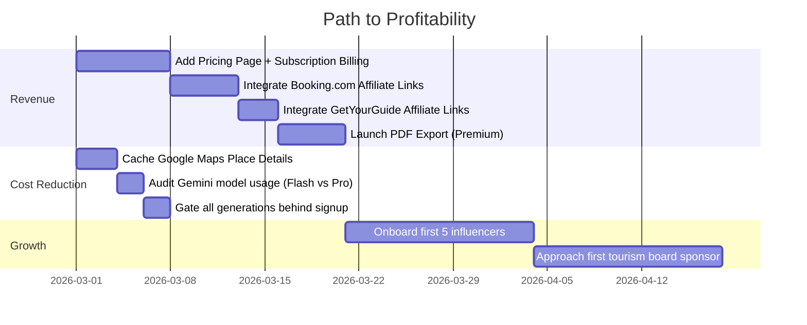

# NextDestination.ai — Monetization Strategy
## Profitability-First, Pre-Investor Playbook

---

## Your Current Cost Structure

Before we talk revenue, let's be honest about what's burning cash:

| Cost Center | When It Fires | Approximate Cost |
|---|---|---|
| **Gemini API** | Every itinerary generation, transcript import, general info | ~$0.01–0.05 per generation (depends on token count) |
| **Google Maps APIs** | Place Search, Place Details, Geocoding | ~$0.003–0.032 per call (varies by API) |
| **Imagen (image gen)** | Itinerary cover images | ~$0.02–0.04 per image |
| **Supabase** | Always-on DB + Auth | Free tier covers early stage |
| **Hosting (Render/Vercel)** | Always-on | ~$0–25/mo at current scale |

> [!IMPORTANT]
> Your **caching layers** (destinations, attractions, general-info, itinerary cache) are already saving you significant API costs. Every cache hit = $0. This is smart engineering. Keep leaning into it.

---

## 💰 Revenue Streams — Ranked by Effort vs Impact

### 1. 🎯 Freemium Plan Upgrades (You're 90% There)

**What you have:** Stripe integration, `plan_config` table, quota middleware, upgrade flow.

**What's working:**
- Starter: 5 generations, 1 save (great free hook)
- Explorer: 50 generations, 10 saves + voice agent
- Custom: unlimited everything + affiliate + package selling

**What to fix to start earning:**

| Action | Why |
|---|---|
| **Switch to recurring billing** | Your Stripe is set to `mode: 'payment'` (one-time). Switch to `mode: 'subscription'` for monthly/annual revenue. Recurring revenue is what makes a business fundable. |
| **Price it right** | Explorer: **₹299/mo** or **₹2499/yr** (~$3.50/mo). Custom: **₹999/mo** or **₹7999/yr**. These feel accessible for Indian travellers while covering your API costs with margin. |
| **Add a visible pricing page** | You currently only show upgrade on the profile page. Add a `/pricing` page with clear feature comparison. Gate premium features behind visible "🔒 Upgrade" prompts in the UI. |
| **Tighten the free tier** | 5 generations is generous. Consider **3 generations, 1 save** for the free tier. The goal: let them taste the magic, then pay to keep building. |

> [!TIP]
> **Unit economics check:** If Explorer costs you ~₹5–15 in API calls per month per user, and they pay ₹299/mo, you're already at **~95% gross margin**. That's excellent.

---

### 2. 🏨 Affiliate Commissions (Zero Engineering, Immediate Revenue)

You already have `has_affiliate` in your plan_config. Now use it.

**High-value affiliate programs for travel:**

| Partner | Commission | Integration Effort |
|---|---|---|
| **Booking.com** Affiliate | 25–40% of their commission | Just add referral links to hotel recommendations |
| **GetYourGuide** | 8% per activity booking | Add links to activity cards |
| **Amazon Associates** | 1–10% on travel gear | Add to packing lists / travel essentials |
| **Skyscanner** Affiliate | CPA per click/booking | Add to transport section |
| **Hostelworld** | Per booking | Budget traveller segment |
| **TripAdvisor** | CPA | Link restaurant/attraction reviews |

**How to implement:**
1. When your itinerary recommends "Hotel XYZ in Bali" → append your Booking.com affiliate link
2. When it suggests "Snorkeling tour" → link to GetYourGuide with your affiliate tag
3. This requires **zero API cost** — it's just URL decoration on existing recommendations

**Expected revenue:** ₹50–500 per booking conversion. Even at 1% conversion on your traffic, this adds up.

> [!NOTE]
> Start with **Booking.com + GetYourGuide** only. Don't spread thin. These two cover hotels + activities which are your highest-intent recommendations.

---

### 3. 📄 PDF Export as Premium Feature

**Cost to you:** Essentially zero (server-side HTML→PDF generation).

**Value to user:** High. Travellers want offline itineraries, especially international trips with no data.

**Implementation:**
- Free: View itinerary online only
- Explorer+: Download beautiful PDF with maps, timings, contact info, emergency numbers
- Already a natural premium gate that feels fair, not frustrating

---

### 4. 📊 Sponsored Destination Placements (Phase 2)

Tourism boards and destination marketing organizations (DMOs) pay to promote destinations.

**How it works:**
- When user searches "beach vacation" → show sponsored destinations (e.g., "Explore Ras Al Khaimah ✨ Sponsored")
- Your `/planning-suggestions` page with community trips is a natural placement surface
- Tourism boards of smaller destinations (Kerala, Meghalaya, Oman, Georgia) actively seek platforms like yours

**Pricing model:** CPM (cost per thousand impressions) or flat monthly sponsorship.

**Revenue potential:** ₹10,000–50,000/mo per sponsor. Even 2–3 sponsors = meaningful revenue.

---

### 5. 🤝 Influencer Revenue Share (Your Growth Plan, Monetized)

Your influencer plan is brilliant for growth. Here's how to monetize it too:

- Influencer creates itinerary with affiliate links → you take **20–30% of affiliate revenue**
- This aligns incentives: they promote harder, you both earn more
- Track via unique affiliate sub-IDs per creator

---

## 🔧 Cost Optimization (Reduce the Burn)

These are things you can do **right now** to cut costs:

### Already Done ✅
- Destination caching (DB lookup before Gemini call)
- Attractions caching
- General info caching
- Image reuse on remix (skip regeneration)
- Concurrency limiting on Google Maps calls
- Rate limiting on AI endpoints

### Do Next 🔨

| Optimization | Expected Savings |
|---|---|
| **Cache Google Maps Place Details** in DB (you cache destinations but not individual place lookups) | ~30–50% reduction in Maps API calls |
| **Use Gemini Flash** (if not already) for lighter tasks like transcript extraction | ~10x cheaper than Pro for simple tasks |
| **Batch Gemini calls** where possible (combine multiple small prompts into one) | ~20–30% token savings |
| **Lazy-load map tiles** — don't load Google Maps JS until user scrolls to map section | Reduces Maps JS API load costs |
| **Anonymous user limits** — require signup before ANY generation (currently you allow some anonymous usage) | Eliminates cost from drive-by users who never convert |

---

## 📈 Profitability Roadmap

---

## 💡 The Investor Story (When You're Ready)

When you do approach investors, here's what they'll want to see:

1. **Unit economics are positive** — "Each paying user costs us ₹X in API calls and pays ₹Y/month"
2. **Organic growth loop** — "Influencers bring users for free, users create shareable itineraries, which bring more users"
3. **Multiple revenue streams** — "Subscriptions + affiliate commissions + sponsored placements"
4. **Defensibility** — "Cached destination data, community itineraries, and creator network create a moat"

> [!TIP]
> **Target metrics before approaching investors:**
> - 500+ registered users
> - 50+ paying subscribers
> - ₹30,000+/mo revenue (subscriptions + affiliates)
> - 10+ active influencer creators
> - Positive unit economics proven over 3 months

---

## ⚡ Quick Wins — Start This Week

1. **Add a `/pricing` page** with Starter vs Explorer vs Custom comparison
2. **Switch Stripe to subscription mode** (`mode: 'subscription'`)
3. **Sign up for Booking.com Affiliate Partner Programme** (takes ~48hrs to approve)
4. **Tighten free tier to 3 generations** — nudge more users toward upgrade
5. **Add "🔒 Upgrade to unlock" prompts** when free users hit limits (make it helpful, not annoying)

These 5 actions can make you revenue-positive within weeks, not months.
