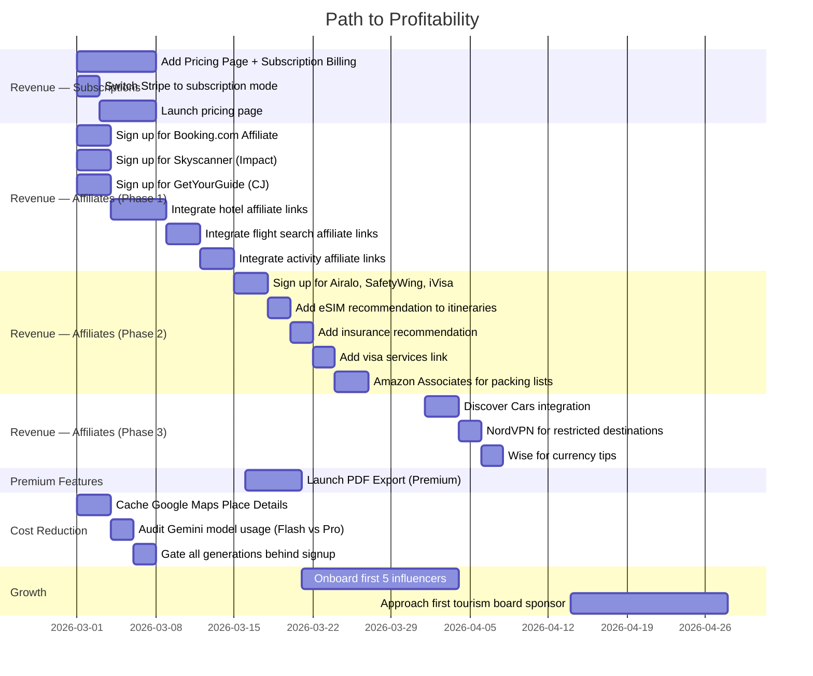

# NextDestination.ai — Monetization Strategy
## Profitability-First, Pre-Investor Playbook

> **Last Updated**: February 26, 2026
> **Status**: Active — Phase 1 in progress
> **Related Docs**: [Payments Plan](./monetization_and_payments_plan.md) | [Manual Tasks](./manual_tasks.md)

---

## Table of Contents

1. [Current Cost Structure](#current-cost-structure)
2. [Revenue Stream 1 — Freemium Plan Upgrades](#1--freemium-plan-upgrades)
3. [Revenue Stream 2 — Affiliate Commissions (The Big One)](#2--affiliate-commissions-the-big-one)
4. [Revenue Stream 3 — PDF Export](#3--pdf-export-as-premium-feature)
5. [Revenue Stream 4 — Sponsored Placements](#4--sponsored-destination-placements-phase-2)
6. [Revenue Stream 5 — Influencer Revenue Share](#5--influencer-revenue-share)
7. [Payment Gateway & Payout Infrastructure](#payment-gateway--payout-infrastructure)
8. [Cost Optimization](#cost-optimization)
9. [Profitability Roadmap](#profitability-roadmap)
10. [Investor Story](#the-investor-story)
11. [Quick Wins](#quick-wins--start-this-week)

---

## Current Cost Structure

Before we talk revenue, let's be honest about what's burning cash:

| Cost Center | When It Fires | Approximate Cost |
|---|---|---|
| **Gemini API** | Every itinerary generation, transcript import, general info | ~$0.01–0.05 per generation (depends on token count) |
| **Google Maps APIs** | Place Search, Place Details, Geocoding | ~$0.003–0.032 per call (varies by API) |
| **Imagen (image gen)** | Itinerary cover images | ~$0.02–0.04 per image |
| **Supabase** | Always-on DB + Auth | Free tier covers early stage |
| **Hosting (Render/Vercel)** | Always-on | ~$0–25/mo at current scale |

> [!IMPORTANT]
> Your **caching layers** (destinations, attractions, general-info, itinerary cache) are already saving you significant API costs. Every cache hit = $0. This is smart engineering. Keep leaning into it.

---

## Revenue Streams — Ranked by Effort vs Impact

### 1. Freemium Plan Upgrades

**Implementation Status: 90% complete**

**What's built:** Stripe integration (`server/routes/stripe.js`), `plan_config` table, quota middleware (`server/middleware/roleAuth.js`), upgrade flow, success page.

**Current plan tiers:**

| Plan | Generations | Saves | Voice Agent | Affiliate | Sell Packages |
|------|:-----------:|:-----:|:-----------:|:---------:|:-------------:|
| **Starter** (Free) | 5 | 1 | No | No | No |
| **Explorer** | 50 | 10 | Yes | No | No |
| **Custom** | Unlimited | Unlimited | Yes | Yes | Yes |

**What to fix to start earning:**

| Action | Why |
|---|---|
| **Switch to recurring billing** | Stripe is set to `mode: 'payment'` (one-time) in `stripe.js:90`. Switch to `mode: 'subscription'` for monthly/annual revenue. Recurring revenue is what makes a business fundable. |
| **Price it right** | Explorer: **₹299/mo** or **₹2499/yr** (~$3.50/mo). Custom: **₹999/mo** or **₹7999/yr**. Accessible for Indian travellers while covering API costs with margin. |
| **Add a visible `/pricing` page** | Currently only shown on the profile page. Add a dedicated `/pricing` page with clear feature comparison. Gate premium features behind visible "Upgrade" prompts in the UI. |
| **Tighten the free tier** | 5 generations is generous. Consider **3 generations, 1 save** for the free tier. The goal: let them taste the magic, then pay to keep building. |

> [!TIP]
> **Unit economics check:** If Explorer costs you ~₹5–15 in API calls per month per user, and they pay ₹299/mo, you're already at **~95% gross margin**. That's excellent.

---

### 2. Affiliate Commissions (The Big One)

You already have `has_affiliate` in your plan_config. This is where serious passive revenue lives. Every section of your itinerary is a monetization surface — flights, hotels, activities, gear, insurance, connectivity, transport.

**Strategy:** Turn every recommendation in the itinerary into a revenue-generating affiliate link. Zero API cost — it's just URL decoration on existing recommendations.

---

#### 2.1 Flight Affiliates

| Partner | Commission Model | Commission Rate | Cookie Duration | Integration Point | Signup |
|---|---|---|---|---|---|
| **Skyscanner** | CPC (per click-out) | ~$0.40–1.00 per click-out; 20% of Skyscanner's income | 30 days | Transport/flights section of itinerary — "Find flights" button | [partners.skyscanner.net](https://www.partners.skyscanner.net) via Impact |
| **Kiwi.com** (via Travelpayouts) | CPA | 1.1–1.15% of booking value | 30 days | Alternative flight search option | [travelpayouts.com](https://www.travelpayouts.com) |
| **WayAway** | CPA | Up to 50% revenue share on WayAway Plus | 30 days | "Best flight deals" card in itinerary | [travelpayouts.com](https://www.travelpayouts.com) |

**Where it fits in the app:**
- When itinerary shows "Flight: Delhi → Bali" → add a "Search Flights" button linking to Skyscanner with origin, destination, dates pre-filled
- The existing **flight search** feature in the manual items dropdown is a perfect integration point

> [!NOTE]
> **Priority pick: Skyscanner** — Highest brand trust, simple click-out model, no need to handle bookings. Sign up via Impact affiliate network.

---

#### 2.2 Hotel & Accommodation Affiliates

| Partner | Commission Model | Commission Rate | Cookie Duration | Best For | Signup |
|---|---|---|---|---|---|
| **Booking.com** | Revenue share (tiered) | 25–40% of Booking.com's commission (~$7.50–$12 on a $200 booking) | Session-based | All hotel recommendations | [booking.com/affiliate-program](https://www.booking.com/affiliate-program/v2/index.html) or via CJ/Awin |
| **Agoda** | Revenue share (tiered) | 4–7% based on monthly volume | 30 days | Asia-Pacific destinations | Via Travelpayouts or direct |
| **Hostelworld** | Per booking | 18–22% commission | 30 days | Budget travellers, backpackers | Via CJ Affiliate |
| **TripAdvisor** | CPC | 50% of TripAdvisor's partner commission on click-outs | 14 days | Hotel reviews & comparisons | [tripadvisor.com/affiliates](https://www.tripadvisor.com) |

**Where it fits in the app:**
- Every hotel recommendation in the itinerary → "Book on Booking.com" link with affiliate tag
- The existing **hotel search** feature in manual items → embed Booking.com deep links with destination + dates
- Budget itineraries → link to Hostelworld instead

**Commission tiers for Booking.com:**
- 1–50 stayed bookings/month → 25%
- 51–150 stayed bookings → 30%
- 151–500 stayed bookings → 35%
- 500+ stayed bookings → 40%

> [!NOTE]
> **Priority pick: Booking.com** — Highest trust, widest inventory, best commission structure. Apply first — takes ~48hrs to approve.

---

#### 2.3 Activities & Experiences Affiliates

| Partner | Commission Model | Commission Rate | Cookie Duration | Inventory | Signup |
|---|---|---|---|---|---|
| **GetYourGuide** | CPS (per sale) | 8% per booking | 30 days | 4,500+ destinations, 180+ countries | [partner.getyourguide.com](https://partner.getyourguide.com) via CJ |
| **Viator** (TripAdvisor) | CPS | 8% per completed experience | 30 days | 300,000+ experiences, 2,500 destinations | [partnerresources.viator.com](https://partnerresources.viator.com) |
| **Klook** | CPS | 2–5% per booking | 30 days (7 days for hotels) | Strong in Asia-Pacific | [affiliate.klook.com](https://affiliate.klook.com) |
| **Tiqets** | CPS | ~$6 per sale or 50% of gross margin | Varies | Museums, city passes, guided tours | Via Travelpayouts |

**Where it fits in the app:**
- When itinerary suggests "Snorkeling tour in Bali" → "Book on GetYourGuide" link
- Activity cards in the day-by-day view → deep links to Viator/GetYourGuide
- City-specific experiences → Klook for Asian destinations, Viator/GYG for global

**Payout details (Viator):**
- PayPal: Weekly payouts, no minimum
- Bank transfer: Monthly, $50 minimum

> [!NOTE]
> **Priority pick: GetYourGuide + Viator** — Together they cover almost every activity globally. 8% on experiences with high AOV ($50–200) = $4–16 per conversion.

---

#### 2.4 Car Rental Affiliates

| Partner | Commission Model | Commission Rate | Cookie Duration | Signup |
|---|---|---|---|---|
| **Discover Cars** | Revenue share | 70% of Discover Cars' profit per rental (~$20–50/sale avg) | **365 days** | [discovercars.com/affiliate](https://www.discovercars.com/affiliate) |
| **RentalCars.com** | CPS | 6% of car price element | 30 days | Via CJ Affiliate |
| **Auto Europe** | CPS | 5% on completed rentals | 7 days | [autoeurope.com/affiliate-program](https://www.autoeurope.com/affiliate-program/) |

**Where it fits in the app:**
- Road trip itineraries → "Rent a Car" button with destination + dates pre-filled
- Airport arrival sections → "Book airport pickup / rental car" link

> [!NOTE]
> **Priority pick: Discover Cars** — 365-day cookie, highest commission per conversion ($20–50 avg), great for road trip itineraries.

---

#### 2.5 Travel Insurance Affiliates

| Partner | Commission Model | Commission Rate | Cookie Duration | Best For | Signup |
|---|---|---|---|---|---|
| **SafetyWing** | CPS | 10% recurring (repeat purchases within a year) | 30 days | Digital nomads, long-term travellers | [safetywing.com](https://safetywing.com) |
| **World Nomads** | CPS | Per-policy commission (varies by region) | 30 days | Adventure travellers | [worldnomads.com](https://www.worldnomads.com) |
| **Allianz Travel** | CPS | Up to 40% per sale | Varies | Premium travellers | Via CJ/Awin |
| **VisitorsCoverage** | CPS | Up to $150 per sale | Varies | International visitors | Direct |

**Where it fits in the app:**
- Pre-trip checklist section → "Get Travel Insurance" card
- International itineraries → auto-suggest insurance with affiliate link
- Emergency info section → link to purchase coverage

> [!NOTE]
> **Priority pick: SafetyWing** — 10% recurring commission, beloved by the digital nomad/travel community, easy integration.

---

#### 2.6 Amazon Associates — Travel Gear

| Category | Commission Rate | Examples |
|---|---|---|
| Luggage & Bags | 3–4% | Suitcases, backpacks, packing cubes |
| Outdoor & Sports | 3–4% | Hiking gear, water bottles, portable chargers |
| Electronics | 1–3% | Travel adapters, noise-cancelling headphones, cameras |
| Books & Guides | 4.5% | Travel guidebooks, language phrasebooks |
| Clothing | 4% | Rain jackets, hiking shoes, travel clothing |

**Performance Multiplier (New 2025):** Amazon introduced a 3-tier performance multiplier on top of base rates based on monthly volume and conversion rate.

**Where it fits in the app:**
- AI-generated packing lists → each item links to Amazon with affiliate tag
- "Travel essentials" section in itineraries → curated product recommendations
- Destination-specific gear (e.g., "Bali essentials: reef-safe sunscreen, waterproof phone case")

**Signup:** [affiliate-program.amazon.com](https://affiliate-program.amazon.com) (Amazon.in for India, Amazon.com for global)

> [!NOTE]
> Amazon commissions are low individually (3–4%), but the **volume potential is high** because every itinerary generates packing list recommendations. Best as a supplementary revenue stream.

---

#### 2.7 eSIM & Connectivity Affiliates

| Partner | Commission Model | Commission Rate | Cookie Duration | Signup |
|---|---|---|---|---|
| **Airalo** | CPS | 10%+ per sale (scales with volume) | Via Impact platform | [partners.airalo.com](https://partners.airalo.com/solutions/affiliates) |
| **Holafly** | CPS | 12–18% per sale | 30 days | Direct program |

**Where it fits in the app:**
- International itineraries → "Stay connected: Get an eSIM" card before departure day
- Connectivity tips in the general info section → Airalo/Holafly links
- Multi-country itineraries → recommend regional eSIM plans

> [!NOTE]
> **Priority pick: Airalo** — World's largest eSIM store, strong brand, 10%+ commission, dedicated affiliate manager. Perfect fit for international travellers.

---

#### 2.8 Visa Services Affiliate

| Partner | Commission Model | Commission Rate | Cookie Duration | Signup |
|---|---|---|---|---|
| **iVisa** | CPS | 10–20% on service fees; 35% on photos | **365 days** | [ivisatravel.com/affiliates](https://ivisatravel.com/affiliates) via Awin |

**Where it fits in the app:**
- Visa requirements section in itinerary → "Check visa requirements" and "Apply online" links
- Pre-trip checklist → visa application as an action item with iVisa link
- International itineraries → auto-detect if visa is needed based on nationality

> [!NOTE]
> 365-day cookie and 10–20% commission make iVisa a hidden gem. Every international itinerary is a potential conversion.

---

#### 2.9 VPN Affiliates (Travel Security)

| Partner | Commission Model | Commission Rate | Cookie Duration | Signup |
|---|---|---|---|---|
| **NordVPN** | Revenue share | 100% on 1-month plans; 40% on 1–2yr plans; 30% recurring renewals | 30 days | [nordvpn.com/affiliate](https://nordvpn.com/affiliate/) |
| **ExpressVPN** | CPA | $13–36 per sale (based on plan length) | 90 days | Direct program |

**Where it fits in the app:**
- Travel safety tips section → "Protect your data while travelling" with VPN recommendation
- Countries with internet restrictions (China, Iran, etc.) → auto-suggest VPN

> [!NOTE]
> VPN affiliate commissions are among the highest ($13–57 per sale). Best positioned as a travel safety recommendation for destinations with restricted internet.

---

#### 2.10 Travel Fintech Affiliates

| Partner | Commission Model | Commission Rate | Cookie Duration | Signup |
|---|---|---|---|---|
| **Wise** (TransferWise) | CPA | £10 per personal user; £50 per business user | No expiry | [wise.com/us/blog/become-a-wise-affiliate-partner](https://wise.com/us/blog/become-a-wise-affiliate-partner) |

**Where it fits in the app:**
- Currency exchange section → "Get the best rates with Wise" recommendation
- Budget breakdown → "Save on currency conversion" tip with Wise link
- Multi-currency itineraries → link to Wise for travel money

---

#### Affiliate Integration Summary — Where Each Fits in the Itinerary

```
┌─────────────────────────────────────────────────────┐
│               ITINERARY VIEW                         │
├─────────────────────────────────────────────────────┤
│                                                      │
│  PRE-TRIP CHECKLIST                                  │
│  ├── Visa Required? ──────────── iVisa (10-20%)      │
│  ├── Travel Insurance ─────────── SafetyWing (10%)   │
│  ├── Get eSIM ─────────────────── Airalo (10%+)      │
│  ├── VPN for travel ───────────── NordVPN (40%)      │
│  └── Currency/Money ───────────── Wise (£10/user)    │
│                                                      │
│  TRANSPORT                                           │
│  ├── Flights ──────────────────── Skyscanner (CPC)   │
│  ├── Car Rental ───────────────── Discover Cars (70%)│
│  └── Airport Transfer ─────────── Booking.com        │
│                                                      │
│  ACCOMMODATION                                       │
│  ├── Hotels ───────────────────── Booking.com (25-40%)│
│  ├── Hostels ──────────────────── Hostelworld (18-22%)│
│  └── Reviews ──────────────────── TripAdvisor (CPC)  │
│                                                      │
│  DAY-BY-DAY ACTIVITIES                               │
│  ├── Tours & Experiences ──────── GetYourGuide (8%)  │
│  ├── Local Activities ─────────── Viator (8%)        │
│  └── Asia Activities ─────────── Klook (2-5%)        │
│                                                      │
│  PACKING LIST                                        │
│  └── All gear items ───────────── Amazon (3-4%)      │
│                                                      │
└─────────────────────────────────────────────────────┘
```

---

#### Affiliate Aggregator Networks

Instead of signing up individually, consider these networks that bundle multiple travel brands:

| Network | Brands Available | Why Use It |
|---|---|---|
| **Travelpayouts** | 100+ travel brands (Booking.com, Kiwi.com, Viator, RentalCars, Airalo, etc.) | Single dashboard, single payout, 100% free. Earn 60–70% of Travelpayouts' income. |
| **CJ Affiliate** | Booking.com, GetYourGuide, Hostelworld, many more | Enterprise-grade tracking, reliable payouts |
| **Awin** | Booking.com, iVisa, and others | Strong European presence |
| **Impact** | Skyscanner, Airalo | Modern platform, good analytics |

> [!TIP]
> **Recommended approach:** Start with **Travelpayouts** for quick multi-brand access, then sign up directly with high-value partners (Booking.com, Skyscanner) for better commission rates as volume grows.

---

#### Revenue Projection — Affiliate Income

Assuming 1,000 itineraries generated/month with modest conversion:

| Affiliate Category | Conv. Rate | Avg Commission | Monthly Revenue |
|---|---|---|---|
| Hotels (Booking.com) | 3% | ₹500 (~$6) | ₹15,000 |
| Flights (Skyscanner) | 5% | ₹50 (~$0.60 CPC) | ₹2,500 |
| Activities (GYG/Viator) | 2% | ₹400 (~$5) | ₹8,000 |
| Car Rental (Discover Cars) | 1% | ₹2,000 (~$25) | ₹20,000 |
| Insurance (SafetyWing) | 1% | ₹300 (~$3.50) | ₹3,000 |
| eSIM (Airalo) | 2% | ₹200 (~$2.50) | ₹4,000 |
| Amazon (gear) | 2% | ₹100 (~$1.20) | ₹2,000 |
| VPN (NordVPN) | 0.5% | ₹2,500 (~$30) | ₹12,500 |
| Visa (iVisa) | 1% | ₹400 (~$5) | ₹4,000 |
| **Total** | | | **₹71,000/mo (~$850)** |

> These are conservative estimates. At 10,000 itineraries/month, this scales to **₹7+ lakh/mo**.

---

### 3. PDF Export as Premium Feature

**Cost to you:** Essentially zero (server-side HTML to PDF generation).

**Value to user:** High. Travellers want offline itineraries, especially international trips with no data.

**Implementation:**
- Free: View itinerary online only
- Explorer+: Download beautiful PDF with maps, timings, contact info, emergency numbers
- Already a natural premium gate that feels fair, not frustrating

---

### 4. Sponsored Destination Placements (Phase 2)

Tourism boards and destination marketing organizations (DMOs) pay to promote destinations.

**How it works:**
- When user searches "beach vacation" → show sponsored destinations (e.g., "Explore Ras Al Khaimah — Sponsored")
- Your `/planning-suggestions` page with community trips is a natural placement surface
- Tourism boards of smaller destinations (Kerala, Meghalaya, Oman, Georgia) actively seek platforms like yours

**Pricing model:** CPM (cost per thousand impressions) or flat monthly sponsorship.

**Revenue potential:** ₹10,000–50,000/mo per sponsor. Even 2–3 sponsors = meaningful revenue.

---

### 5. Influencer Revenue Share

Your influencer/creator plan is brilliant for growth. Here's how to monetize it too:

- Influencer creates itinerary with affiliate links → you take **20–30% of affiliate revenue**
- This aligns incentives: they promote harder, you both earn more
- Track via unique affiliate sub-IDs per creator
- Creator dashboard shows earnings, clicks, conversions

**Payout to creators:**
- Monthly payouts via Stripe Connect (or manual bank transfer initially)
- Minimum payout threshold: ₹500
- Creator gets 70–80%, platform keeps 20–30%

---

## Payment Gateway & Payout Infrastructure

### Current Implementation Status

| Component | Status | Location |
|---|---|---|
| Stripe Checkout (one-time) | Built | `server/routes/stripe.js` |
| Webhook handler | Built | `server/routes/stripe.js:112` |
| Plan config DB table | Built | `database/011_create_user_profiles.sql` |
| Stripe price ID mapping | Built | `database/012_add_stripe_columns.sql` |
| Quota middleware | Built | `server/middleware/roleAuth.js` |
| Profile with plan display | Built | `packages/web-next/app/profile/page.tsx` |
| Upgrade success page | Built | `packages/web-next/app/upgrade/success/page.tsx` |
| Subscription billing | **Not yet** | Change `mode: 'payment'` → `mode: 'subscription'` |
| Pricing page | **Not yet** | Need `/pricing` route |

### Payment Gateway Comparison

| Gateway | Domestic Fees | International Fees | Currencies | Best For |
|---|---|---|---|---|
| **Stripe** (Primary) | ~2% + GST | ~3% + conversion | 135+ | Already integrated, global reach |
| **Razorpay** (Secondary) | ~2% | ~3% + conversion | 100+ | Indian UPI/netbanking fallback |
| **PayPal** (Alternative) | ~4.4% + fixed | Same | 200+ | Users who prefer PayPal |
| **Paddle / Lemon Squeezy** (MoR) | Higher fees | Handles all tax compliance | Global | If VAT/GST across 100+ countries feels overwhelming |

### Going Live Checklist

| Step | Status | Timeline |
|------|--------|----------|
| Register business entity (Sole Prop or LLP) | Pending | 1–15 days |
| Open current bank account | Pending | 1–2 days |
| Apply for GST registration | Pending | 7–15 days |
| Complete Stripe India KYC | Pending | 1–3 days |
| Switch Stripe test → live mode | Pending | Same day |
| Switch `mode: 'payment'` → `mode: 'subscription'` | Pending | 1 day dev |
| Apply for IEC (for international forex) | Phase 3 | 7–15 days |
| Add refund policy & legal pages | Pending | 1 day |

### Compliance Requirements

| Requirement | Domestic Payments | International Payments |
|---|:---:|:---:|
| PAN Card | Required | Required |
| Business Registration | Required | Required (LLP/Pvt Ltd recommended) |
| GST Registration | If revenue > ₹20L/yr | Required |
| Current Bank Account | Recommended | Required |
| FEMA / RBI Compliance | No | Required for forex |
| IEC (Import Export Code) | No | Required for receiving forex |

---

## Cost Optimization

### Already Done
- Destination caching (DB lookup before Gemini call)
- Attractions caching
- General info caching
- Image reuse on remix (skip regeneration)
- Concurrency limiting on Google Maps calls
- Rate limiting on AI endpoints

### Do Next

| Optimization | Expected Savings |
|---|---|
| **Cache Google Maps Place Details** in DB (you cache destinations but not individual place lookups) | ~30–50% reduction in Maps API calls |
| **Use Gemini Flash** (if not already) for lighter tasks like transcript extraction | ~10x cheaper than Pro for simple tasks |
| **Batch Gemini calls** where possible (combine multiple small prompts into one) | ~20–30% token savings |
| **Lazy-load map tiles** — don't load Google Maps JS until user scrolls to map section | Reduces Maps JS API load costs |
| **Anonymous user limits** — require signup before ANY generation (currently you allow some anonymous usage) | Eliminates cost from drive-by users who never convert |

---

## Profitability Roadmap



---

## The Investor Story

When you do approach investors, here's what they'll want to see:

1. **Unit economics are positive** — "Each paying user costs us ₹X in API calls and pays ₹Y/month"
2. **Organic growth loop** — "Influencers bring users for free, users create shareable itineraries, which bring more users"
3. **Multiple revenue streams** — "Subscriptions + affiliate commissions across 10+ travel verticals + sponsored placements"
4. **Defensibility** — "Cached destination data, community itineraries, and creator network create a moat"
5. **Revenue diversification** — "Not dependent on any single affiliate partner; revenue spread across hotels, flights, activities, insurance, connectivity, gear"

> [!TIP]
> **Target metrics before approaching investors:**
> - 500+ registered users
> - 50+ paying subscribers
> - ₹30,000+/mo revenue (subscriptions + affiliates)
> - 10+ active influencer creators
> - Positive unit economics proven over 3 months
> - At least 3 active affiliate revenue streams

---

## Quick Wins — Start This Week

### Immediate (Day 1–3)
1. **Sign up for Booking.com Affiliate Partner Programme** (~48hrs to approve)
2. **Sign up for Travelpayouts** (instant access to 100+ travel brands)
3. **Sign up for Skyscanner via Impact** (flight affiliate)
4. **Switch Stripe to subscription mode** (`mode: 'subscription'`)

### This Week (Day 4–7)
5. **Add a `/pricing` page** with Starter vs Explorer vs Custom comparison
6. **Add affiliate links to hotel recommendations** in itineraries (Booking.com)
7. **Add "Search Flights" button** with Skyscanner affiliate link in transport section
8. **Tighten free tier to 3 generations** — nudge more users toward upgrade

### Next Week
9. **Integrate GetYourGuide/Viator links** on activity cards
10. **Add Airalo eSIM recommendation** for international itineraries
11. **Add SafetyWing insurance card** in pre-trip checklist
12. **Add "Upgrade to unlock" prompts** when free users hit limits

These actions can make you revenue-positive within weeks, not months.
