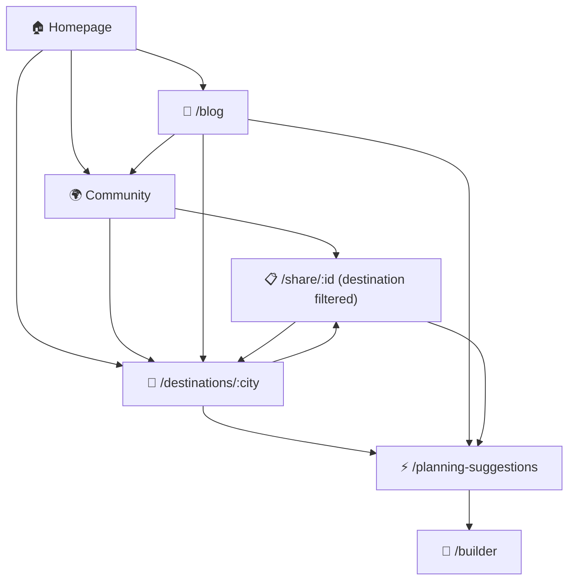

# 🌍 SEO Strategy — NextDestination.ai

## Executive Summary

NextDestination.ai is an **AI-powered travel itinerary planner** with community-driven trip sharing, voice-assisted planning, hotel/flight/activity search, and Stripe-based premium upgrades. This document outlines a battle-tested SEO strategy to capture high-intent travel planning traffic.

> [!NOTE]
> **Last updated: 2026-02-22** — Phase 1 foundation implemented. Post Next.js migration: sitemap resubmission and Bing Webmaster verification still pending. See [Progress Tracker](#-prioritized-action-items) below for status.

---

## SEO Audit — Status Tracker

| Area | Status | Notes |
|------|--------|-------|
| Meta Description | ✅ Done | Per-page via `react-helmet-async` in `SEOHead.tsx` |
| Open Graph / Twitter Cards | ✅ Done | All 14 routes + default in `index.html` |
| `robots.txt` | ✅ Done | `/packages/web/public/robots.txt` |
| `sitemap.xml` | ✅ Done | Static sitemap in `/packages/web/public/sitemap.xml` |
| Structured Data (JSON-LD) | ✅ Done | WebApplication, FAQ, CollectionPage, HowTo, TouristTrip |
| Canonical URLs | ✅ Done | Per-page via `SEOHead.tsx` |
| Default OG Image | ✅ Done | `/packages/web/public/og-default.png` |
| Page-level `<title>` tags | ✅ Done | Unique titles on all 14 routes |
| Alt text on images | ⚠️ Pending | Image SEO still needs attention |
| Heading hierarchy | ⚠️ Partial | Needs audit across components |
| Client-side rendering (CSR) | 🔴 Pending | Pre-rendering solution needed |
| Image optimization (WebP, lazy) | ⚠️ Partial | Some images from CDNs |
| Core Web Vitals | ⚠️ Unknown | Need Lighthouse audit |
| Internal linking | ⚠️ Weak | Only navbar + footer links |
| URL structure | ✅ Clean | `/community`, `/planning-suggestions` |
| Google Search Console | ⚠️ Partial | Registered on old SPA — sitemap resubmission needed after Next.js migration |
| Google Analytics 4 | 🔴 Pending | Needs setup |

> [!WARNING]
> **Remaining blocker**: NextDestination.ai is a client-side SPA. Google can render JavaScript but it's unreliable and slow. Without **pre-rendering or SSR**, some pages may not get indexed reliably.

---

## 🎯 Keyword Strategy — Travel Planning Niche

### Tier 1: High-Intent Transactional Keywords (Primary Targets)

These are the keywords people search when they're **actively planning a trip** — your direct conversion targets.

| Keyword | Monthly Search Volume (est.) | Difficulty | Page Target |
|---------|----|------------|-------------|
| ai travel planner | 12K–18K | Medium | Homepage |
| ai itinerary generator | 6K–10K | Medium | Homepage |
| travel itinerary builder | 4K–8K | Medium | Homepage |
| trip planner ai | 8K–14K | Medium | Homepage |
| ai trip planner free | 5K–9K | Low-Med | Homepage |
| custom travel itinerary | 3K–6K | Low | `/planning-suggestions` |
| create travel itinerary online | 2K–4K | Low | `/planning-suggestions` |

### Tier 2: Destination-Specific Long-Tail Keywords (Content Goldmine)

These are **scalable**. Every destination you support becomes a keyword opportunity.

| Keyword Pattern | Example | Volume (per keyword) | Page Target |
|-----------------|---------|------|-------------|
| `{city} itinerary {N} days` | "paris itinerary 5 days" | 5K–20K | Destination-specific landing pages |
| `things to do in {city}` | "things to do in bali" | 50K–200K | Destination guide pages |
| `{city} travel guide 2026` | "tokyo travel guide 2026" | 3K–10K | Destination guide pages |
| `{city} trip budget` | "bali trip budget" | 2K–8K | Blog / Guide content |
| `best time to visit {city}` | "best time to visit paris" | 10K–40K | Blog / Guide content |
| `{city} solo travel` | "japan solo travel" | 5K–15K | Community filtered itineraries |
| `{city} couple trip` | "paris couple trip" | 3K–8K | Community filtered itineraries |
| `family vacation {city}` | "family vacation rome" | 5K–12K | Community filtered itineraries |

### Tier 3: Informational / Top-of-Funnel Keywords

| Keyword | Volume | Difficulty | Content Format |
|---------|--------|------------|----------------|
| how to plan a trip | 30K–50K | High | Ultimate Guide (Blog) |
| travel planning tips | 8K–15K | Medium | Blog post |
| packing list for {destination} | 5K–20K | Low | Blog / Tool |
| cheapest countries to travel | 15K–30K | Medium | Blog / Listicle |
| solo travel destinations 2026 | 3K–8K | Low | Blog |
| travel budget calculator | 5K–10K | Low | Interactive Tool |
| honeymoon destinations | 20K–40K | High | Blog / Curated List |

---

## 📐 Technical SEO — Implementation Roadmap

### Phase 1: Foundation (Week 1–2) — *Must Do Before Anything Else*

#### 1.1 Pre-rendering / SSR Strategy

Since the app is a Vite SPA, choose one of these approaches:

| Approach | Effort | SEO Benefit | Recommended? |
|----------|--------|-------------|-------------|
| **Prerender.io or similar service** | Low | High | ✅ Quick win |
| **Vite SSG plugin** (`vite-ssg`) | Medium | High | ✅ Best for static pages |
| **Migrate to Next.js** | High | Highest | 🔮 Long-term ideal |
| **Dynamic rendering** (serve pre-rendered to bots) | Medium | High | ✅ Good interim |

> [!IMPORTANT]
> **Recommended approach**: Use a **dynamic rendering** service (like Prerender.io or Rendertron) as an immediate fix. This serves fully-rendered HTML to search engine crawlers while keeping your SPA experience for users. Add Vercel Edge middleware to detect crawler user-agents and redirect them to pre-rendered versions.

#### 1.2 Create `robots.txt`

```
# /public/robots.txt
User-agent: *
Allow: /
Disallow: /builder
Disallow: /profile
Disallow: /upgrade/
Disallow: /login
Disallow: /signup

Sitemap: https://nextdestination.ai/sitemap.xml
```

> [!TIP]
> Block authenticated-only pages (`/builder`, `/profile`) — they have no SEO value and dilute crawl budget.

#### 1.3 Create `sitemap.xml`

Generate a dynamic sitemap that includes:

```xml
<?xml version="1.0" encoding="UTF-8"?>
<urlset xmlns="http://www.sitemaps.org/schemas/sitemap/0.9">
  <!-- Static pages -->
  <url><loc>https://nextdestination.ai/</loc><priority>1.0</priority><changefreq>weekly</changefreq></url>
  <url><loc>https://nextdestination.ai/community</loc><priority>0.9</priority><changefreq>daily</changefreq></url>
  <url><loc>https://nextdestination.ai/how-it-works</loc><priority>0.6</priority><changefreq>monthly</changefreq></url>
  <url><loc>https://nextdestination.ai/contact</loc><priority>0.3</priority><changefreq>monthly</changefreq></url>

  <!-- Dynamic: Shared itineraries (crawl goldmine!) -->
  <url><loc>https://nextdestination.ai/share/abc123</loc><priority>0.7</priority></url>
  <!-- ... more shared itineraries ... -->
</urlset>
```

> [!IMPORTANT]
> **Shared itineraries** (`/share/:id`) are your single biggest SEO asset. Each is a unique, user-generated page about a specific destination. A dynamic sitemap pulling from your database is essential.

#### 1.4 Per-Page Meta Tags & Open Graph

Add `react-helmet-async` (or equivalent) to set per-route meta tags:

| Page | Title Tag | Meta Description |
|------|-----------|-----------------|
| `/` (Home) | `AI Travel Planner — Build Your Perfect Itinerary │ NextDestination.ai` | `Plan your dream trip in seconds with AI. Get personalized itineraries with flights, hotels, and activities. Free travel planner powered by AI.` |
| `/community` | `Community Travel Itineraries — Real Trips by Real Travelers │ NextDestination.ai` | `Browse and remix travel itineraries created by our community. Solo trips, couple getaways, and family vacations to 150+ destinations.` |
| `/planning-suggestions` | `Plan Your {Destination} Trip — AI Itinerary Builder │ NextDestination.ai` | `Create a custom {destination} itinerary. Choose your dates, travel style, and interests — AI builds your perfect plan in seconds.` |
| `/share/:id` | `{Destination} Itinerary — {N} Day Trip │ NextDestination.ai` | `Explore this {N}-day {destination} itinerary with {activity_count} activities, hotels, and travel tips. Remix it for your own trip.` |
| `/how-it-works` | `How It Works — AI-Powered Travel Planning │ NextDestination.ai` | `See how NextDestination.ai uses AI to create personalized travel itineraries. Plan smarter, travel better.` |

**Open Graph tags** for every page (critical for social sharing):
```html
<meta property="og:type" content="website" />
<meta property="og:title" content="..." />
<meta property="og:description" content="..." />
<meta property="og:image" content="https://nextdestination.ai/og-image.jpg" />
<meta property="og:url" content="https://nextdestination.ai/..." />
<meta name="twitter:card" content="summary_large_image" />
```

#### 1.5 Structured Data (JSON-LD)

Add schema markup to appear in Google's rich results:

**Homepage** — `WebApplication` + `Organization`:
```json
{
  "@context": "https://schema.org",
  "@type": "WebApplication",
  "name": "NextDestination.ai",
  "url": "https://nextdestination.ai",
  "description": "AI-powered travel itinerary planner",
  "applicationCategory": "TravelApplication",
  "operatingSystem": "Web",
  "offers": {
    "@type": "Offer",
    "price": "0",
    "priceCurrency": "USD"
  }
}
```

**Shared Itineraries** — `TouristTrip` + `ItemList`:
```json
{
  "@context": "https://schema.org",
  "@type": "TouristTrip",
  "name": "5-Day Paris Adventure",
  "touristType": "Couple",
  "itinerary": {
    "@type": "ItemList",
    "numberOfItems": 15,
    "itemListElement": [
      { "@type": "TouristAttraction", "name": "Eiffel Tower" },
      { "@type": "TouristAttraction", "name": "Louvre Museum" }
    ]
  }
}
```

**Community Page** — `CollectionPage`:
```json
{
  "@context": "https://schema.org",
  "@type": "CollectionPage",
  "name": "Community Travel Itineraries",
  "description": "Browse real travel itineraries made by our community"
}
```

---

### Phase 2: Content Engine (Week 3–6)

#### 2.1 Destination Landing Pages (Programmatic SEO)

This is the **highest ROI SEO activity**. Create auto-generated destination pages at URLs like:

```
/destinations/paris
/destinations/tokyo
/destinations/bali
```

Each page should contain:
- ✅ Destination name, country, hero image (AI-generated or Unsplash)
- ✅ AI-generated "General Info" (you already cache this in your `destinations` table!)
- ✅ Top attractions (from your cached `attractions` data!)
- ✅ Community itineraries for that destination (filtered from your `itineraries` table)
- ✅ CTA: "Plan Your {City} Trip Now" → links to `/planning-suggestions`
- ✅ Proper H1, meta tags, structured data for each

> [!TIP]
> You already have the data — `destinations` table has `general_info` and `attractions`. This is pure SEO gold sitting unused. Each destination page targets `"{city} travel guide"`, `"{city} itinerary"`, `"things to do in {city}"` keywords.

**Estimated pages**: Start with top 50 destinations → scale to 500+. Each page targets 5–10 long-tail keywords.

#### 2.2 Blog / Travel Guides Section

Create a `/blog` route with content targeting informational keywords:

| Content Piece | Target Keyword | Estimated Volume |
|---------------|---------------|-----------------|
| "The Ultimate Guide to Planning Your First Solo Trip" | solo travel planning | 8K |
| "10 Best Destinations for Couples in 2026" | couple travel destinations 2026 | 5K |
| "How to Plan a Trip: A Step-by-Step Guide" | how to plan a trip | 40K |
| "Budget Travel: 15 Countries Under $50/Day" | budget travel countries | 20K |
| "Paris in 3 Days: The Perfect Itinerary" | paris 3 day itinerary | 12K |
| "Bali vs Thailand: Which is Right for You?" | bali vs thailand | 6K |
| "Travel Packing Checklist (Free Download)" | travel packing checklist | 15K |

> [!TIP]
> Every blog post should link to your **planner tool** with a specific CTA. For example, "Paris in 3 Days" → "Create your own Paris itinerary with AI" button.

#### 2.3 FAQ Section / Schema

Add FAQPage structured data targeting "People Also Ask" results:

```
Q: Is NextDestination.ai free?
Q: How does AI travel planning work?
Q: Can I customize my itinerary?
Q: How do I share my travel itinerary?
Q: What destinations does NextDestination.ai support?
```

---

### Phase 3: Authority Building (Week 7–12)

#### 3.1 Link Building Strategy

| Tactic | Effort | Expected Links/Month |
|--------|--------|---------------------|
| **Travel blogger outreach** — offer free premium access for reviews | Medium | 5–10 |
| **HARO / Help a B2B Writer** — respond to travel tech queries | Low | 2–5 |
| **Guest posts** on travel blogs, linking to destination pages | Medium | 3–5 |
| **Product Hunt launch** — drives initial domain authority | One-time | 20–50 |
| **"Travel Planning" tool roundups** — get listed in listicles | Medium | 5–10 |
| **Embed widget** — let users embed their itineraries on blogs | Medium | Organic |
| **Community sharing** — shared itinerary links = natural backlinks | Low | Organic |

#### 3.2 Social Signals & Distribution

| Platform | Strategy |
|----------|----------|
| **Pinterest** | Pin every shared itinerary with the AI-generated infographic image. Travel is Pinterest's #1 category. |
| **Instagram** | Share itinerary infographics (you already generate 3:4 images!). Link to `/share/:id` pages. |
| **Twitter/X** | Auto-tweet community itineraries with Open Graph previews. |
| **Reddit** | Engage in r/travel, r/solotravel, r/backpacking — share value, not spam. |
| **TikTok** | Short screen-recording demos of AI itinerary generation. |

#### 3.3 Internal Linking Architecture



- Every destination page links to related itineraries, blog posts, and the planner
- Every shared itinerary links back to the destination page
- Blog posts link to relevant destination pages and the planner tool
- Community page links to top destination pages

---

## 📊 KPI Tracking & Goals

### Month 1–3 Targets
| Metric | Current | Target |
|--------|---------|--------|
| Indexed pages | ~1 (maybe) | 50+ |
| Organic traffic | ~0 | 500–1,000/month |
| Domain Authority | 0 | 10–15 |
| Average position (target keywords) | Not ranking | Top 50 |
| Core Web Vitals (LCP) | Unknown | < 2.5s |

### Month 4–6 Targets
| Metric | Target |
|--------|--------|
| Indexed pages | 200+ |
| Organic traffic | 5,000–10,000/month |
| Domain Authority | 20–25 |
| Featured snippets captured | 5+ |
| Long-tail keyword rankings (top 10) | 50+ |

### Month 7–12 Targets
| Metric | Target |
|--------|--------|
| Indexed pages | 500+ |
| Organic traffic | 25,000–50,000/month |
| Domain Authority | 30–40 |
| Conversion rate (visitor → plan created) | 5–8% |
| Revenue from organic traffic | Trackable via UTMs |

---

## 🏁 Prioritized Action Items

### ✅ Week 1 — Critical Foundation (COMPLETED)
1. ~~Add `robots.txt` to `/public`~~ ✅ `packages/web/public/robots.txt`
2. ~~Create static `sitemap.xml`~~ ✅ `packages/web/public/sitemap.xml`
3. ~~Install `react-helmet-async` and add per-page `<title>`, meta description, OG tags~~ ✅ `SEOHead.tsx` + all routes
4. ~~Add canonical URLs to every page~~ ✅ Via `SEOHead.tsx`
5. ~~Register Google Search Console~~ ✅ Done — Resubmit updated sitemap after Next.js migration — 🔴 **TODO**
   - Sitemap URL: `https://nextdestination.ai/sitemap.xml`
6. Register Bing Webmaster Tools + submit sitemap — 🔴 **TODO**
   - Sitemap URL: `https://nextdestination.ai/sitemap.xml`
7. Set up Google Analytics 4 — 🔴 **TODO**

### ✅ Week 2 — Structured Data (COMPLETED)
7. Implement pre-rendering solution (Prerender.io or Vercel ISR) — 🟠 **TODO**
8. ~~Add JSON-LD structured data to homepage, community, shared itineraries~~ ✅ 5 schemas
9. ~~Create OG image assets (default + per-shared-itinerary using AI images)~~ ✅ `og-default.png` + dynamic
10. Fix heading hierarchy across all pages — 🟠 **TODO**

### 🟡 Week 3–4 — Content Pages
11. Build `/destinations/:city` route with programmatic pages from existing database
12. ~~Add FAQ section to homepage with FAQPage schema~~ ✅ FAQPage JSON-LD added
13. Ensure all images have descriptive `alt` text

### 🟢 Week 5–8 — Growth
14. Launch `/blog` section with first 5 articles
15. Product Hunt launch
16. Begin travel blogger outreach
17. Start Pinterest strategy with itinerary infographics
18. Build dynamic sitemap API pulling from database

### 🔵 Month 3+ — Scale
19. Scale destination pages to 200+
20. Publish 2 blog posts/week
21. A/B test meta descriptions for CTR improvement
22. Implement `hreflang` tags if you go multi-language
23. Add breadcrumb structured data
24. Explore Google Travel integration

---

## 🔑 Competitive Advantage

Your app has **built-in data moats** that most travel SEO competitors lack:

1. **AI-generated itineraries** = unique, non-duplicated content at scale
2. **Community itineraries** = user-generated content that grows organically  
3. **Cached destination data** (general info + attractions) = ready-made destination pages
4. **AI-generated infographic images** = shareable visual assets for Pinterest/Instagram
5. **Voice-assisted planning** = differentiator for "ai travel planner" positioning

> [!IMPORTANT]
> The biggest untapped opportunity is turning your **shared itineraries** (`/share/:id`) and **cached destination data** into indexable, keyword-rich pages. This is a content moat that competitors like Wanderlog, TripIt, and Wonderplan cannot easily replicate because your content is both AI-generated AND community-validated.

---

*This strategy is designed specifically for NextDestination.ai's architecture, data assets, and growth stage. Execution priority should follow the phased roadmap above.*
