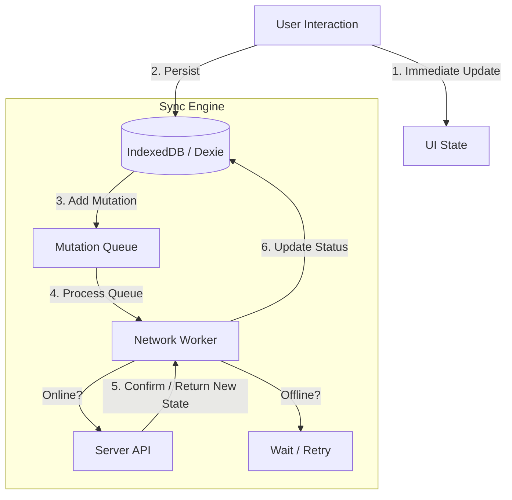

# Local-First Architecture & Sync Strategy

## 1. Executive Summary
This document outlines the architectural strategy for the **NextDestination Travel Itinerary Builder**. The core philosophy is **"Local-First"**: users interact primarily with a local database to ensure zero-latency performance and offline capabilities, while a background process handles synchronization with the server.

## 2. Core Principles
*   **Zero Latency**: UI interactions (drag-and-drop, typing) must never be blocked by network requests.
*   **Offline-Ready**: The app must be fully functional without an internet connection.
*   **Data Integrity**: User data must never be lost during network failures or tab closures.
*   **Seamless Onboarding**: Users can build anonymously and merge data when they sign up.

---

## 3. Phased Implementation Plan

### Phase 1: Robust Local Storage (Current Focus)
**Goal**: Move beyond `localStorage` limits to a robust, structured local database.

*   **Technology**: **IndexedDB** (via `Dexie.js` wrapper).
*   **Why**:
    *   `localStorage` is synchronous (blocks UI) and limited to ~5MB.
    *   `IndexedDB` is asynchronous, supports large datasets (images/blobs), and allows complex querying.
*   **Action Items**:
    *   [ ] Install `dexie` and `dexie-react-hooks`.
    *   [ ] Define schema for `Itineraries` and `Activities`.
    *   [ ] Migrate existing `localStorage` data to IndexedDB on startup.

### Phase 2: The Sync Engine (Queue System)
**Goal**: Reliability. Ensure changes made offline eventually reach the server.

*   **Concept**: **Optimistic UI + Request Queue**.
*   **Workflow**:
    1.  **User Action**: User adds "Eiffel Tower" to Day 1.
    2.  **Local Commit**: UI updates immediately. Data saved to IndexedDB.
    3.  **Queue**: A "Change Mutation" is added to a `SyncQueue` table.
        *   `{ id: uuid, type: 'ADD_ACTIVITY', payload: { ... }, status: 'PENDING' }`
    4.  **Network Worker**:
        *   Detects `navigator.onLine`.
        *   Process the queue sequentially (FIFO).
        *   On success: Remove from queue.
        *   On failure: Retry with exponential backoff.

### Phase 3: Identity & Data Merging
**Goal**: seamless transition from Guest to Registered User.

*   **Scenario**: A user spends 30 minutes building a trip as a guest, then clicks "Save to Cloud" or "Login".
*   **Strategy**: **"The Backpack Pattern"**
    1.  When a user logs in, the app checks the Local DB for "orphan" itineraries (created by 'guest').
    2.  App prompts: *"We found 1 unsaved trip. Add it to your account?"*
    3.  On confirmation, the client pushes these complete itinerary objects to the server with the new `userId`.
    4.  Local DB is updated to reflect that these items are now `synced: true`.

### Phase 4: Conflict Resolution (Future Proofing)
**Goal**: Handle editing the same trip on multiple devices (Mobile + Desktop).

*   **Strategy**: **Last Write Wins (LWW)** (Initial approach)
    *   Each entity has an `updatedAt` timestamp.
    *   When pulling from server, if `Server.updatedAt > Local.updatedAt`, overwrite local.
    *   *Advanced*: Field-level merging (CRDTs) - simpler to start with entity-level LWW.

---

## 4. Logical Data Flow (Diagram)

---

## 5. Technology Stack Recommendation

| Component | Technology | Rationale |
| :--- | :--- | :--- |
| **Local DB** | **Dexie.js** | Best-in-class wrapper for IndexedDB. Typed & easy to use. |
| **Server State** | **TanStack Query** | Handles caching, background fetching, and optimistic updates perfectly. |
| **State Mgmt** | **React Context / Zustand** | For managing the global "Sync Status" (Saving... Saved... Offline). |

## 6. Immediate Next Steps
1.  **Refactor**: Replace `localStorageService.ts` with a `db.ts` using Dexie.
2.  **Schema**: Define the Typescript interfaces for the database schema.
3.  **Hook**: Create a `useLiveQuery` hook to read itineraries efficiently in React components.
